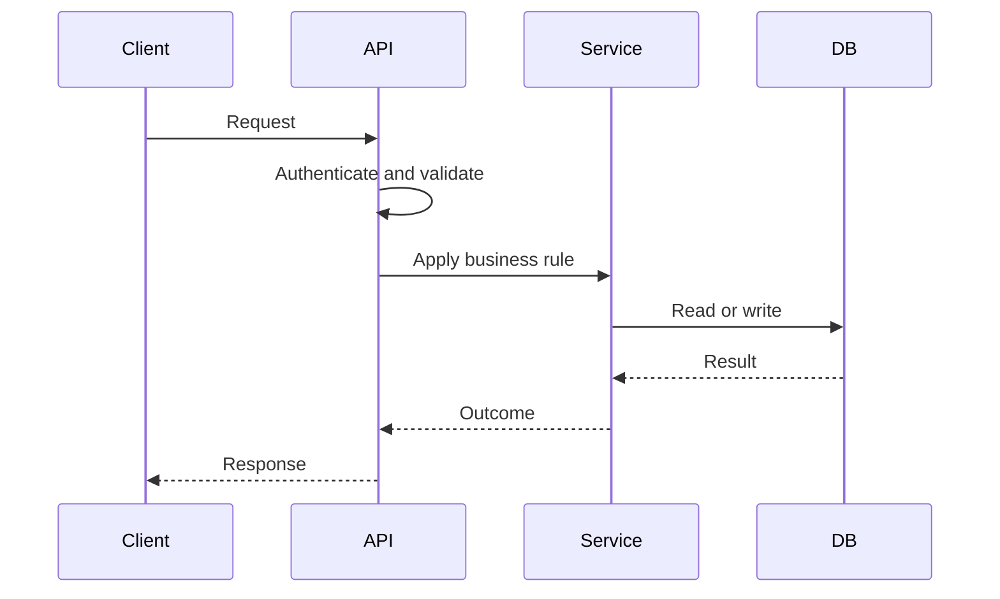

# API Design Best Practices

An API is a contract between systems. Good API design makes behavior predictable for clients while protecting the server from invalid, unsafe, or expensive requests.

## Design Principles

- Model resources and actions from business language.
- Validate every input on the server.
- Use consistent status codes and error shapes.
- Separate authentication from authorization.
- Version or evolve contracts carefully.

## Common Mistakes

- Designing endpoints around frontend buttons.
- Returning 200 OK for failed operations.
- Leaking internal errors to users.
- Ignoring idempotency for retries and payments.

## Further Reading

- [REST API Design](../resources/rest-api-design.md)
- [APIs](../learning-tracks/developer-ecosystem/modules/09-apis.md)

