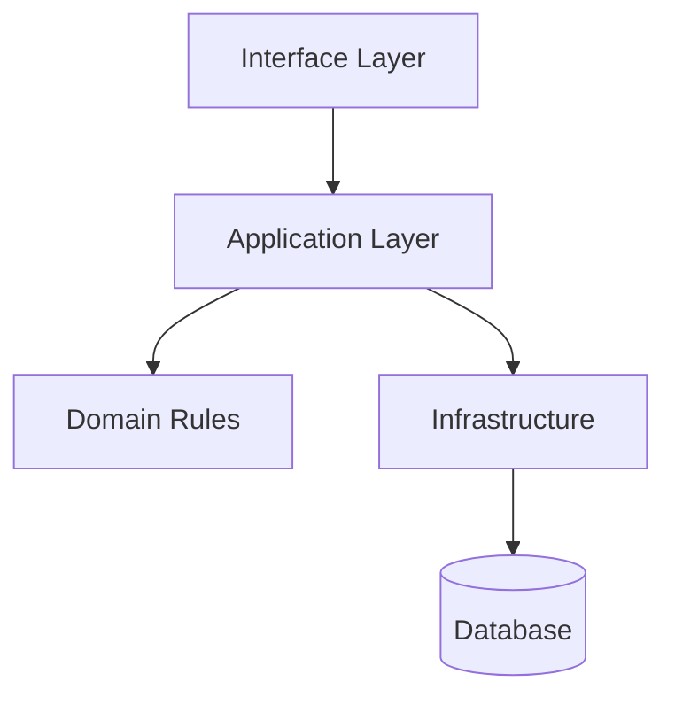

# Architecture Design Patterns

Architecture is the set of boundaries and communication rules that keeps software understandable as it grows. Patterns are reusable names for common trade-offs, not recipes to apply blindly.

## Common Patterns

- Layered architecture separates interface, business logic, and data access.
- MVC separates model, view, and controller responsibilities.
- Clean or hexagonal architecture protects business rules from framework details.
- Event-driven architecture decouples producers and consumers but adds operational complexity.

## When to Use Patterns

Use a pattern when it reduces coupling, clarifies ownership, or makes testing and deployment safer. Avoid patterns that add ceremony without solving a current or near-future problem.

## Common Mistakes

- Calling every folder structure an architecture.
- Mixing database queries directly into presentation logic.
- Over-engineering small projects with enterprise patterns.

## Business Perspective

Architecture affects hiring, maintenance cost, release speed, and reliability. A simple architecture that a small team understands is often more valuable than a complex architecture copied from a large company.

## Further Reading

- [Software Architecture](../learning-tracks/developer-ecosystem/modules/31-software-architecture.md)
- [Project Template](../projects/PROJECT_TEMPLATE.md)

