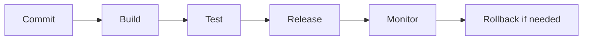

# Deployment Guides

Deployment turns a project into an operated system. The goal is not simply to make a URL work; the goal is to make releases repeatable, secure, observable, and reversible.

## Deployment Lifecycle

## Engineering Workflow

1. Identify runtime, database, storage, and secrets.
2. Create environment-specific configuration.
3. Build from source using repeatable commands.
4. Run checks before release.
5. Deploy small changes.
6. Monitor logs and user flows.
7. Document rollback steps.

## Trade-offs

Managed platforms reduce operational burden but can create pricing and platform limits. Virtual machines give control but require patching, security hardening, and monitoring. Containers improve portability but add image, registry, and orchestration concerns.

## Common Mistakes

- Hard-coding local database URLs.
- Assuming free tiers behave like production.
- Ignoring backups and migrations.
- Not checking logs after deployment.

## Further Reading

- [Deployment Checklist Template](../templates/deployment-checklist.md)
- [Deployment Platforms](../learning-tracks/developer-ecosystem/modules/03-deployment-platforms.md)
- [CI/CD](../learning-tracks/developer-ecosystem/modules/06-ci-cd.md)

