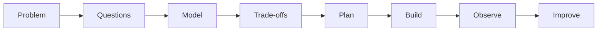

# How to Think Like a Developer

Developers are not people who memorize syntax. They are people who convert unclear problems into reliable systems through questions, models, trade-offs, and feedback.

## Core Mindset

Start with why the system exists, who depends on it, what can go wrong, and how success will be measured. Then choose the smallest design that satisfies those constraints.

## Practical Workflow

1. Restate the problem in plain language.
2. Identify users, data, rules, and failure cases.
3. Draw the system before choosing libraries.
4. Split work into testable checkpoints.
5. Explain every decision as a trade-off.

## Common Mistakes

- Starting with code before understanding behavior.
- Treating errors as surprises instead of requirements.
- Optimizing for impressive tools instead of maintainability.

## Business Perspective

Engineering thinking protects time and money. Clear decisions reduce rework, make estimates more honest, and help teams build features users can trust.

## Further Reading

- [Learning-First Philosophy](../philosophy/LEARNING_FIRST.md)
- [Architecture Design Patterns](./architecture-design-patterns.md)
- [Debugging Techniques](../resources/debugging-techniques.md)

