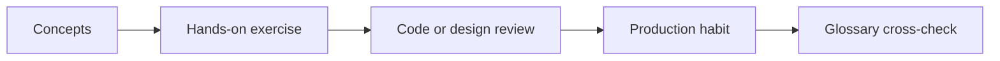

# 02 — Package Management

> Central glossary: [Engineering Glossary](../glossary.md)

## Covered Concepts
- **npm** — see [Glossary](../glossary.md#npm).
- **pnpm** — see [Glossary](../glossary.md#pnpm).
- **Yarn** — see [Glossary](../glossary.md#yarn).
- **Bun** — see [Glossary](../glossary.md#bun).
- **package.json** — see [Glossary](../glossary.md#packagejson).
- **package-lock.json** — see [Glossary](../glossary.md#package-lockjson).
- **Semantic Versioning** — see [Glossary](../glossary.md#semantic-versioning).
- **node_modules** — see [Glossary](../glossary.md#node_modules).
- **Dependency Trees** — see [Glossary](../glossary.md#dependency-trees).
- **Peer Dependencies** — see [Glossary](../glossary.md#peer-dependencies).

## 1. Definition
Package Management is the industry practice area that turns academic computing knowledge into repeatable team workflows, production systems, and maintainable software.

## 2. Historical Background
This area evolved as software moved from single-machine programs to networked products maintained by distributed teams. Tool names changed, but the core need stayed the same: make change safer, faster, and easier to understand.

## 3. Why It Exists
It exists to reduce coordination cost, operational risk, debugging time, and hidden complexity when many people and systems interact.

## 4. Real-world Analogy
Think of it like a railway system: tracks, signals, schedules, inspections, and stations let many trains move safely without every driver negotiating from scratch.

## 5. Internal Architecture
Most tools in this module have three layers: a human workflow, metadata that records decisions, and automated systems that enforce or execute those decisions.

## 6. Workflow Explanation
1. Learn the vocabulary.
2. Identify the problem the tool solves.
3. Practice the smallest safe workflow locally.
4. Connect it to collaboration, deployment, security, or observability.
5. Review trade-offs before adopting a tool.

## 7. Industry Usage
Teams use these concepts in documentation, pull requests, architecture reviews, incidents, onboarding, interviews, and day-to-day delivery. Product names are examples; the transferable skill is understanding the pattern behind the product.

## 8. Advantages
- Makes professional documentation easier to read.
- Helps students discuss systems using industry vocabulary.
- Connects BCA fundamentals to production engineering.
- Builds confidence for internships, open-source contribution, and interviews.

## 9. Limitations
- Tool knowledge becomes outdated if students memorize screens instead of concepts.
- Beginners can confuse brand names with architecture patterns.
- Production practices require judgment; one workflow rarely fits every team.

## 10. Common Mistakes
- Copying a tool because it is popular without understanding the problem.
- Ignoring security, cost, maintainability, and rollback plans.
- Treating local success as production readiness.

## 11. Interview Questions
- What problem does this concept solve?
- What trade-off does it introduce?
- How would you explain it to a non-technical teammate?
- When would you avoid using it?

## 12. Practical Exercises
- Draw a diagram connecting five terms from this module.
- Find these terms in a real project README or documentation page.
- Write a one-page decision note choosing one tool and rejecting two alternatives.

## 13. Best Practices
- Start from requirements, not hype.
- Document assumptions and failure modes.
- Prefer small reversible changes.
- Connect every new tool to testing, security, and operations.

## 14. Mermaid Diagram

## 15. Cross-links to Related Concepts
- [CI/CD](./06-ci-cd.md)
- [Security](./21-security.md)
- [Monitoring & Observability](./20-monitoring-observability.md)
- [Production Readiness](./33-production-readiness.md)

## 16. References for Further Learning
- Official documentation for the tools mentioned in this module.
- Open-source project READMEs and contribution guides.
- Cloud provider architecture centers and postmortems.
