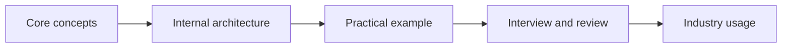

# 49 — JavaScript Runtime

> Part of the [Modern Software Engineering Knowledge Base](../README.md). Use the [Engineering Glossary](../glossary.md) as the central searchable reference.

## Definition
JavaScript Runtime is an advanced engineering domain that helps students understand how professional systems are designed, operated, secured, scaled, or maintained beyond classroom-level programming exercises.

## History
The ideas in this module emerged as software moved from isolated programs into networked, multi-user, always-on products. As systems became larger, engineers needed shared vocabulary, repeatable practices, and specialized tools to manage complexity.

## Core Concepts
- **Call Stack:** a key concept students should be able to define, recognize in documentation, and connect to production trade-offs.
- **Event Loop:** a key concept students should be able to define, recognize in documentation, and connect to production trade-offs.
- **Microtasks:** a key concept students should be able to define, recognize in documentation, and connect to production trade-offs.
- **Macrotasks:** a key concept students should be able to define, recognize in documentation, and connect to production trade-offs.
- **Promises:** a key concept students should be able to define, recognize in documentation, and connect to production trade-offs.
- **Workers:** a key concept students should be able to define, recognize in documentation, and connect to production trade-offs.

## Internal Architecture
A useful mental model is to separate this domain into four layers:

1. **Interface layer** — commands, APIs, protocols, dashboards, specifications, or documents used by people and programs.
2. **Execution layer** — runtimes, services, processors, queues, kernels, agents, or engines that perform the work.
3. **State layer** — files, memory, databases, logs, caches, registries, indexes, metadata, or configuration.
4. **Control layer** — policies, permissions, schedulers, validators, monitoring, reviews, and automation that keep the system safe.

## Practical Examples
- Read official documentation for one concept and summarize the problem it solves in five sentences.
- Find an open-source project that uses this topic and identify where it appears in code, configuration, or documentation.
- Draw a before-and-after diagram showing how the system changes when this topic is introduced.
- Write a failure scenario: what breaks, who notices, and how the team recovers.

## Industry Usage
Professional teams use javascript runtime during architecture reviews, incident response, design discussions, deployment planning, cost analysis, security reviews, and hiring interviews. The goal is not to memorize product names; the goal is to understand the engineering pattern behind them.

## Advantages
- Builds vocabulary needed to read real engineering documents.
- Connects BCA fundamentals to production-scale trade-offs.
- Helps students reason about reliability, security, performance, and maintainability.
- Improves interview answers by moving from definitions to practical judgment.

## Limitations
- Concepts can be misapplied when copied without context.
- Tools in this area may require operational maturity, monitoring, and team discipline.
- Small student projects may need simplified versions rather than full enterprise patterns.

## Common Mistakes
- Treating the topic as a product checklist instead of a problem-solving model.
- Ignoring failure modes, security boundaries, cost, and maintenance ownership.
- Using advanced terminology without being able to explain a simple workflow.
- Skipping diagrams and trade-off notes during design.

## Interview Questions
1. What problem does javascript runtime solve in a production system?
2. Which core concept from this module would you apply first in a small project, and why?
3. What can go wrong if this domain is implemented without monitoring or documentation?
4. Explain one trade-off between simplicity and scalability in this module.
5. How would you teach this topic to a beginner using an analogy?

## Hands-on Exercises
1. Create a one-page concept map linking all core concepts in this module.
2. Write a README section explaining how a project would use this domain.
3. Prepare three flashcards per core concept: definition, example, and common mistake.
4. Review a real incident report or postmortem and identify where this topic appears.

## Mermaid Diagram

## Cross-links to Related Modules
- [Cloud Computing](./04-cloud-computing.md)
- [CI/CD](./06-ci-cd.md)
- [Security](./21-security.md)
- [Networking](./22-networking.md)
- [Production Readiness](./33-production-readiness.md)
- [Engineering Glossary](../glossary.md)

## References
- Official documentation for the named tools, standards, languages, protocols, and platforms in this module.
- Engineering blogs and postmortems from reputable software teams.
- Open-source repositories that demonstrate the concept in production-like projects.
- Textbooks or university notes for the underlying computer science fundamentals.
