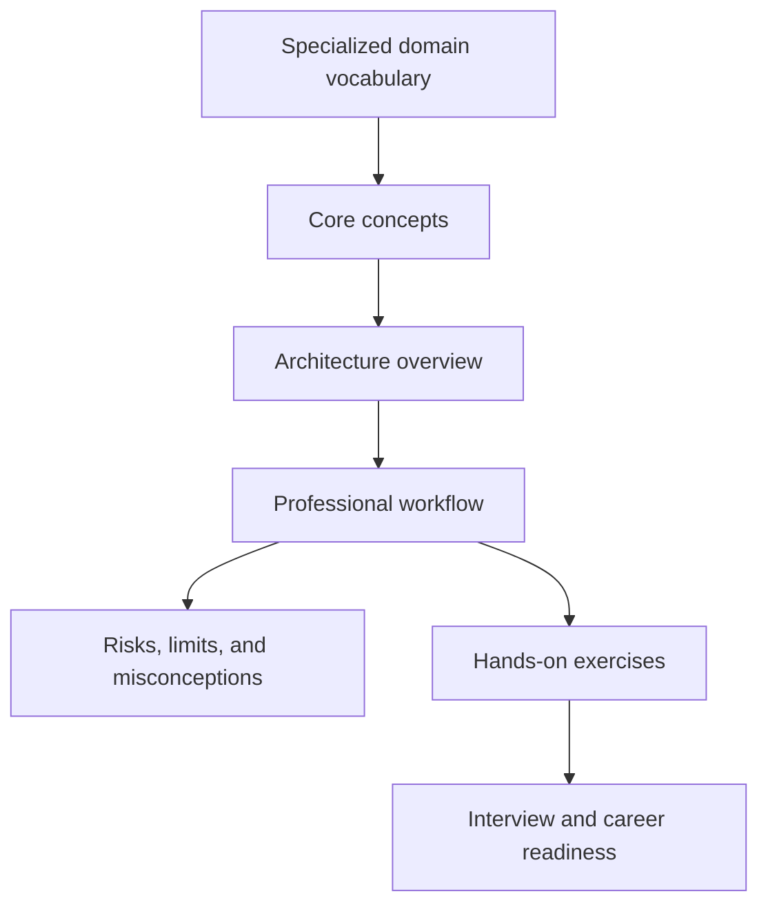

# 98 — Aerospace Software

> Specialized domain extension for the [Modern Software Engineering Knowledge Base](../README.md). This module introduces industry terminology so learners can understand professional discussions even outside conventional software jobs.

## Definition
Aerospace Software is a specialized engineering domain where software connects with reliability, business operations, scientific workflows, hardware, infrastructure, human factors, regulation, or emerging technology.

## Historical Background
This domain grew as computing expanded from academic labs and business applications into global platforms, regulated industries, cyber-physical systems, AI products, scientific instruments, creative tools, and large engineering organizations. The terminology reflects decades of practical lessons from failures, standards, research, and production operations.

## Core Concepts
- **Flight Control:** learn what it means, why specialists use it, what data or systems it affects, and what can go wrong when it is misunderstood.
- **Avionics:** learn what it means, why specialists use it, what data or systems it affects, and what can go wrong when it is misunderstood.
- **DO-178C:** learn what it means, why specialists use it, what data or systems it affects, and what can go wrong when it is misunderstood.
- **Navigation Systems:** learn what it means, why specialists use it, what data or systems it affects, and what can go wrong when it is misunderstood.
- **Telemetry:** learn what it means, why specialists use it, what data or systems it affects, and what can go wrong when it is misunderstood.

## Industry Applications
- **Flight Control:** appears in planning, implementation, review, compliance, operations, or troubleshooting for aerospace software.
- **Avionics:** appears in planning, implementation, review, compliance, operations, or troubleshooting for aerospace software.
- **DO-178C:** appears in planning, implementation, review, compliance, operations, or troubleshooting for aerospace software.
- **Navigation Systems:** appears in planning, implementation, review, compliance, operations, or troubleshooting for aerospace software.
- **Telemetry:** appears in planning, implementation, review, compliance, operations, or troubleshooting for aerospace software.
- Students may never work directly in this field, but recognizing the vocabulary helps when reading documentation, watching conference talks, joining cross-functional teams, or interviewing for specialized roles.

## Architecture Overview
Most systems in this domain can be understood through five layers:

1. **Input layer** — users, devices, requests, datasets, signals, source files, events, or business requirements enter the system.
2. **Processing layer** — algorithms, runtimes, services, engines, models, controllers, pipelines, or human workflows transform the input.
3. **State layer** — databases, files, models, artifacts, logs, measurements, configurations, or domain records preserve important information.
4. **Governance layer** — standards, reviews, policies, permissions, audit trails, safety constraints, or compliance requirements control acceptable behavior.
5. **Output layer** — APIs, dashboards, reports, deployments, decisions, simulations, rendered media, hardware actions, or user experiences deliver value.

## Common Technologies
Typical technologies and standards include: Flight Control, Avionics, DO-178C, Navigation Systems, domain-specific standards, open-source tooling, vendor platforms. Product names change over time, so focus on the role each technology plays in the architecture.

## Workflow Diagrams

## Advantages
- Gives learners vocabulary for industries beyond generic web development.
- Helps connect BCA fundamentals to specialized engineering careers.
- Improves architecture discussions by revealing domain-specific constraints.
- Encourages students to think about safety, regulation, operations, economics, and users.

## Limitations
- Many topics require labs, hardware, domain experts, regulated data, or production environments to practice deeply.
- Introductory knowledge is not a substitute for professional certification, legal compliance, or safety-critical review.
- Tools and standards vary by country, organization, and industry maturity.

## Common Misconceptions
- Believing specialized domains are only for experts and have no relevance to software engineers.
- Memorizing acronyms without understanding workflows, risks, and stakeholders.
- Assuming a technology demo is equivalent to production readiness.
- Ignoring ethical, legal, accessibility, security, privacy, and sustainability concerns.

## Best Practices
- Learn the domain vocabulary before choosing tools.
- Identify stakeholders, failure modes, and compliance requirements early.
- Prefer small prototypes, clear documentation, and reversible decisions.
- Ask domain experts to review assumptions before shipping high-impact systems.
- Connect every specialized system to testing, monitoring, security, and maintenance ownership.

## Interview Questions
1. What makes aerospace software different from general application development?
2. Which concept in this module creates the greatest operational or ethical risk?
3. How would you explain one core concept to a non-specialist stakeholder?
4. What data, hardware, users, or regulations influence this domain?
5. How would you validate a small prototype before calling it production-ready?

## Hands-on Exercises
1. Create a glossary table for the core concepts with one practical example each.
2. Draw a system diagram showing inputs, processing, state, governance, and outputs.
3. Read one public case study or standard related to this field and summarize the engineering trade-offs.
4. Design a beginner-friendly mini project or simulation that demonstrates one concept safely.
5. Write three risks and three mitigations for adopting this technology in a student project.

## Cross-links to Related Modules
- [Cloud Computing](./04-cloud-computing.md)
- [Security](./21-security.md)
- [Monitoring & Observability](./20-monitoring-observability.md)
- [Production Readiness](./33-production-readiness.md)
- [Distributed Systems](./40-distributed-systems.md)
- [Engineering Ethics](./118-engineering-ethics.md)
- [Engineering Glossary](../glossary.md)

## References for Further Learning
- Official standards, specifications, and documentation for the concepts named in this module.
- University lecture notes and textbooks for the mathematical, scientific, or systems foundations.
- Engineering blogs, public postmortems, and architecture case studies from teams working in this domain.
- Open-source projects and sandbox tools that let students explore the topic safely.
