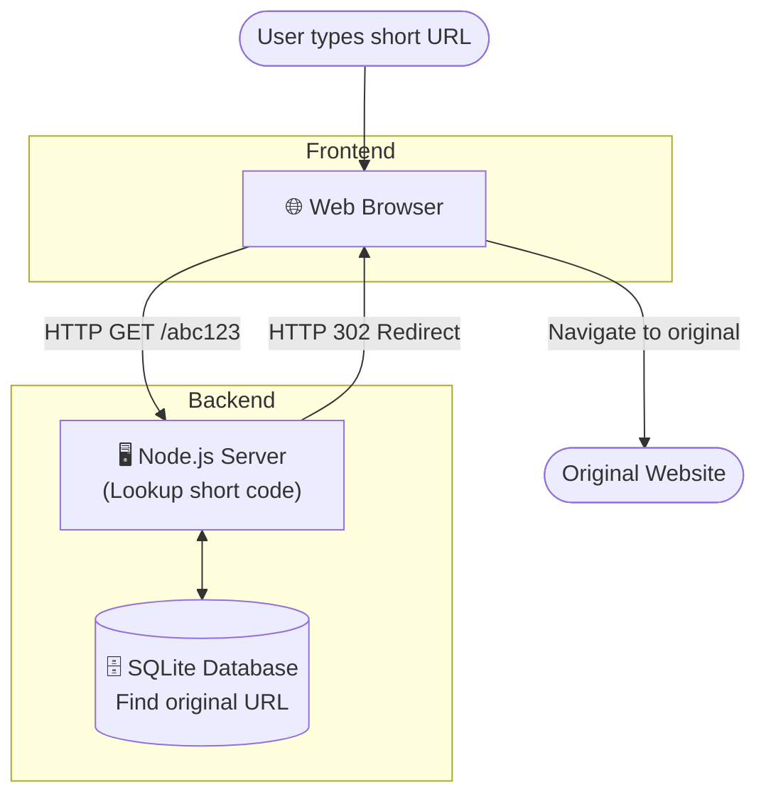
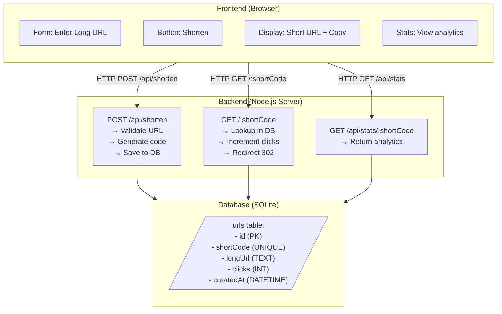
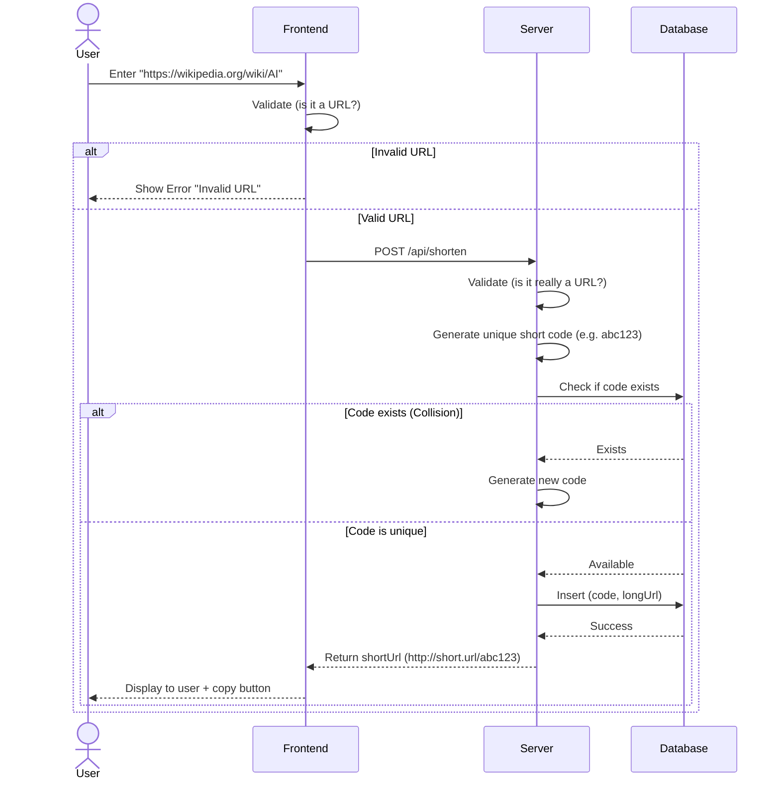
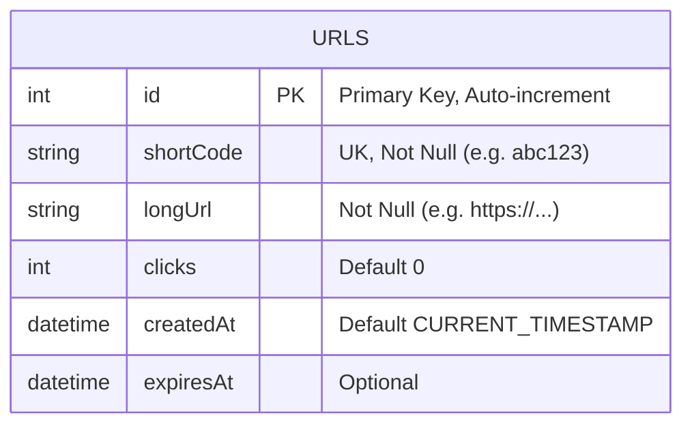

# 🔗 URL Shortener: Learn By Building

**"Build a system that makes long URLs short. Understand every part."**

---

## 🎯 Learning Outcomes

After completing this project, you will understand:

✅ **Database Design** - How to structure data for uniqueness and performance  
✅ **API Design** - How to plan endpoints before coding  
✅ **Redirect Logic** - How HTTP redirects work  
✅ **Click Tracking** - How to maintain statistics  
✅ **URL Validation** - How to verify user input  
✅ **Error Handling** - How to manage failures gracefully  
✅ **Deployment** - How to put code on the internet  
✅ **Debugging** - How to find and fix problems systematically  

---

## 💼 Business Use Case (Real-World Application)

Before writing any code, it's crucial to understand **why** this software exists and how it makes money.

**Who buys this?**
- **Marketing Agencies:** To track the exact number of clicks generated by specific advertising campaigns.
- **Enterprise Brands:** To use custom branded links (e.g., `es.pn` for ESPN, `t.co` for Twitter) which increases brand trust.
- **SMS Marketers:** To fit links into strict 160-character limits for SMS messages.

**How does it make money? (Monetization Model)**
This is typically sold as a **B2B SaaS (Software as a Service)**.
- **Free Tier:** Basic shortening with random strings (e.g., `bit.ly/xyz123`).
- **Premium Tier:** Custom domains, advanced click analytics (geo-location, device type), link expiration, and API access for bulk creation.

---

## 📋 Project Overview

### The Problem

You have URLs like:
```
https://en.wikipedia.org/wiki/Artificial_intelligence?utm_source=twitter&utm_campaign=ai_article_2026
```

This is long, hard to remember, breaks in some contexts.

**Solution:** Create short URLs
```
https://short.url/abc123
```

When someone visits the short URL, they get redirected to the original.

### The Big Picture



**Your job:** Build the server and database.

---

## 🏗️ Architecture: Design Before Coding

### Step 1: Think About Data

**Question 1: What information must you store?**

Think about this before reading below:
- What makes a short URL unique?
- Do you need to know who created it?
- Do you need to count clicks?
- Should URLs expire?

**After thinking, here's what you need:**

| Data | Why? |
|------|------|
| shortCode | The unique identifier (abc123) |
| longUrl | Where to redirect |
| clicks | Analytics: how popular? |
| createdAt | When was this created? |
| expiresAt | (Optional) When should it die? |

### Step 2: Architecture Diagram

Draw this yourself first, then compare:



### Step 3: Data Flow

Trace what happens when user enters a URL:



**Questions to answer:**
- What happens if validation fails?
- What if code already exists?
- What if database is down?

---

## 🗄️ Database: Design, Don't Code

### Schema Design (Think Before SQL)

**Question: How would you structure this?**

Before looking at SQL, answer:
1. What's the primary key? (id or shortCode?)
2. Which fields are required?
3. Which are optional?
4. Should shortCode be UNIQUE?
5. How will you query by shortCode?

**After thinking, here's the structure:**

```sql
CREATE TABLE urls (
  id INTEGER PRIMARY KEY AUTOINCREMENT,
  shortCode TEXT UNIQUE NOT NULL,
  longUrl TEXT NOT NULL,
  clicks INTEGER DEFAULT 0,
  createdAt DATETIME DEFAULT CURRENT_TIMESTAMP,
  expiresAt DATETIME
);
```




**Why each field?**

| Field | Type | Why? |
|-------|------|------|
| id | PRIMARY KEY | Unique identifier |
| shortCode | UNIQUE NOT NULL | Must be unique, used for lookup |
| longUrl | NOT NULL | Must have original URL |
| clicks | DEFAULT 0 | Track popularity |
| createdAt | TIMESTAMP | Know when created |
| expiresAt | DATETIME | Optional: auto-expire links |

**Design Questions (Answer these):**

1. **Why is shortCode UNIQUE?**
   - What happens if two URLs have same code?
   - How do you prevent collisions?

2. **Why not use id for redirect?**
   - Short link would be: short.url/5 (not user-friendly)
   - Code would be: short.url/abc123 (memorable)

3. **What if someone requests an expired URL?**
   - Check createdAt + expiresAt
   - Return 404 or message?

4. **How do you prevent duplicate URLs from being shortened?**
   - Should short.url/abc123 point to same URL as short.url/xyz789?
   - Trade-off: memory vs functionality

---

## 🔌 API Design: Plan Before Coding

### Endpoint 1: Create Short URL

**Think about this:**
- What should user send?
- What should server return?
- What can go wrong?

**After thinking, here's the spec:**

```
Endpoint: POST /api/shorten
Purpose: Create a short URL

REQUEST:
{
  "longUrl": "https://wikipedia.org/wiki/AI",
  "customCode": "ai" (optional)
}

RESPONSE (Success - 200):
{
  "shortCode": "ai",
  "shortUrl": "http://localhost:3000/ai",
  "longUrl": "https://wikipedia.org/wiki/AI"
}

RESPONSE (Error - 400):
{
  "error": "Invalid URL format"
}

RESPONSE (Error - 400):
{
  "error": "Custom code already exists"
}

RESPONSE (Error - 500):
{
  "error": "Database error"
}
```

### Endpoint 2: Redirect

```
Endpoint: GET /:shortCode
Purpose: Redirect to original URL

REQUEST:
GET /ai

RESPONSE (Success - 302 Redirect):
Location: https://wikipedia.org/wiki/AI
(+ increment clicks in database)

RESPONSE (Error - 404):
{
  "error": "URL not found"
}
```

### Endpoint 3: Get Stats (Optional but good to include)

```
Endpoint: GET /api/stats/:shortCode
Purpose: Get analytics for a URL

REQUEST:
GET /api/stats/ai

RESPONSE (Success - 200):
{
  "shortCode": "ai",
  "longUrl": "https://wikipedia.org/wiki/AI",
  "clicks": 42,
  "createdAt": "2026-01-15T10:30:00Z"
}

RESPONSE (Error - 404):
{
  "error": "URL not found"
}
```

---

## 🧠 Implementation: Pseudocode First, Real Code After

### How to Generate Unique Short Codes

**Option 1: Random (What should you choose?)**
```pseudocode
function generateShortCode():
  characters = "ABCDEFGHIJKLMNOPQRSTUVWXYZabcdefghijklmnopqrstuvwxyz0123456789"
  code = ""
  repeat 6 times:
    pick random character from characters
    add to code
  return code

Advantage: _________ (you think)
Disadvantage: _________ (you think)
```

**Option 2: Counter (What about this?)**
```pseudocode
function generateShortCode():
  count = read from database (how many URLs exist?)
  convert count to base62 string
  return base62

Advantage: _________ (you think)
Disadvantage: _________ (you think)
```

**Question: Which would you use? Why?**

---

### Building the Shorten Endpoint

**Pseudocode (NOT real code):**

```pseudocode
function shortenUrl(request):
  Step 1: Get longUrl from request
  Step 2: Validate URL (is it really a URL?)
    If not valid:
      return error "Invalid URL"
  
  Step 3: Check if customCode provided
    If yes:
      code = customCode
    If no:
      code = generateShortCode()
  
  Step 4: Check if code exists in database
    If exists:
      return error "Code already exists"
  
  Step 5: Insert into database
    INSERT urls (shortCode, longUrl) VALUES (code, longUrl)
    If fails:
      return error "Database error"
  
  Step 6: Build short URL
    shortUrl = "http://localhost:3000/" + code
  
  Step 7: Return success
    return {
      shortCode: code,
      shortUrl: shortUrl,
      longUrl: longUrl
    }
```

**Now you write the real code using this pseudocode as guide.**

---

### Building the Redirect Endpoint

**Pseudocode:**

```pseudocode
function redirect(shortCode):
  Step 1: Query database
    SELECT longUrl FROM urls WHERE shortCode = ?
  
  Step 2: Check result
    If no result found:
      return 404 "URL not found"
  
  Step 3: Increment clicks
    UPDATE urls SET clicks = clicks + 1 WHERE shortCode = ?
  
  Step 4: Redirect
    return HTTP 302 redirect to longUrl
```

---

## 🛠️ Starter Template: Skeleton to Fill In

**server.js - Fill in the logic**

```javascript
// URL Shortener - Fill in the implementation

const express = require('express');
const cors = require('cors');
const bodyParser = require('body-parser');
// TODO: Import database library

const app = express();
const PORT = 3000;

// Middleware setup
app.use(cors());
app.use(bodyParser.json());
app.use(express.static('public'));

// TODO: Initialize database connection
// let db = ...;

// TODO: Create database table
// app.get('/init', (req, res) => {
//   // Write CREATE TABLE query here
//   // Execute it
//   // Return success
// });

// ============ API ENDPOINTS ============

// TODO: POST /api/shorten
// Purpose: Create a short URL
// Input: { longUrl, customCode? }
// Output: { shortCode, shortUrl, longUrl }
// Steps:
//   1. Extract longUrl from request
//   2. Validate it's a real URL
//   3. Generate or use customCode
//   4. Check if code already exists
//   5. Insert into database
//   6. Return result
app.post('/api/shorten', (req, res) => {
  // Your implementation here
});

// TODO: GET /:shortCode
// Purpose: Redirect to original URL
// Steps:
//   1. Get shortCode from URL parameter
//   2. Query database for longUrl
//   3. If found: increment clicks, redirect
//   4. If not found: return 404
app.get('/:shortCode', (req, res) => {
  // Your implementation here
});

// TODO: GET /api/stats/:shortCode
// Purpose: Get statistics for a URL
// Return: { shortCode, longUrl, clicks, createdAt }
app.get('/api/stats/:shortCode', (req, res) => {
  // Your implementation here
});

// TODO: DELETE /api/urls/:shortCode (optional)
// Purpose: Delete a short URL
app.delete('/api/urls/:shortCode', (req, res) => {
  // Your implementation here
});

// Start server
app.listen(PORT, () => {
  console.log(`Server running on port ${PORT}`);
});
```

---

## ⚠️ Common Mistakes: What NOT to Do

### ❌ Mistake 1: Hardcoding Short Codes

**Wrong:**
```javascript
app.post('/api/shorten', (req, res) => {
  // BAD! User provides code each time
  const code = req.body.customCode;
  // Then just use it
});
```

**Problem:**
- No uniqueness guarantee
- User inputs matter too much
- Can't auto-generate

**Right:**
```javascript
// Generate code if not provided
const code = customCode || generateShortCode();
// Then validate it doesn't exist
```

---

### ❌ Mistake 2: No URL Validation

**Wrong:**
```javascript
app.post('/api/shorten', (req, res) => {
  const { longUrl } = req.body;
  // Just save it, no validation
  db.save(longUrl);
});
```

**Problem:**
- User sends invalid URL
- Redirect fails
- Database has garbage

**Right:**
```javascript
function isValidUrl(url) {
  try {
    new URL(url); // JavaScript built-in
    return true;
  } catch {
    return false;
  }
}

if (!isValidUrl(longUrl)) {
  return res.status(400).json({ error: 'Invalid URL' });
}
```

---

### ❌ Mistake 3: Checking Uniqueness After Insert

**Wrong:**
```javascript
db.insert(shortCode, longUrl); // Insert first
// Then check if exists
const exists = db.query(shortCode);
```

**Problem:**
- Two requests might use same code
- Race condition
- Database constraint violation

**Right:**
```javascript
// Check FIRST
const exists = db.query(`SELECT * FROM urls WHERE shortCode = ?`, [shortCode]);
if (exists) {
  return res.status(400).json({ error: 'Code exists' });
}
// THEN insert
db.insert(shortCode, longUrl);
```

**Even Better:**
```javascript
// Use database constraint: UNIQUE
// Database prevents duplicates at DB level
CREATE TABLE urls (
  shortCode TEXT UNIQUE NOT NULL
);
```

---

### ❌ Mistake 4: Not Handling Errors

**Wrong:**
```javascript
const result = db.query(shortCode);
res.json({ url: result.longUrl }); // What if not found?
```

**Problem:**
- Crashes if result is null
- User sees error without message

**Right:**
```javascript
const result = db.query(shortCode);
if (!result) {
  return res.status(404).json({ error: 'URL not found' });
}
res.json({ url: result.longUrl });
```

---

### ❌ Mistake 5: Storing Plain URLs

**Wrong:**
```javascript
const longUrl = req.body.longUrl;
db.insert(shortCode, longUrl); // Store as-is
```

**Problem:**
- Might contain malicious content
- XSS vulnerabilities
- Not sanitized

**Right:**
```javascript
const longUrl = req.body.longUrl;
if (!isValidUrl(longUrl)) {
  return res.status(400).json({ error: 'Invalid URL' });
}
// Optionally: sanitize/validate further
db.insert(shortCode, longUrl);
```

---

## 🧪 Testing: How to Verify It Works

### Test 1: Database Connection

**Before everything else:**
```
1. Start server: npm start
2. Should print: "Database connected"
3. If error: debug database setup
```

### Test 2: Create Short URL (Happy Path)

**Test this manually:**
```bash
curl -X POST http://localhost:3000/api/shorten \
  -H "Content-Type: application/json" \
  -d '{"longUrl": "https://wikipedia.org/wiki/AI"}'

Expected response:
{
  "shortCode": "aBcDeF",
  "shortUrl": "http://localhost:3000/aBcDeF",
  "longUrl": "https://wikipedia.org/wiki/AI"
}
```

**Questions:**
- Did it return a short code?
- Is the short code 6 characters?
- Can you access the database and find it?

### Test 3: Create with Invalid URL (Error Path)

**Test error handling:**
```bash
curl -X POST http://localhost:3000/api/shorten \
  -H "Content-Type: application/json" \
  -d '{"longUrl": "not a valid url"}'

Expected: 400 error with message
```

### Test 4: Redirect (The Main Feature)

**After creating a URL:**
```bash
curl -L http://localhost:3000/aBcDeF

Should redirect to original URL
```

**Without -L flag:**
```bash
curl http://localhost:3000/aBcDeF

Should return HTTP 302 with Location header
```

### Test 5: Check Clicks Incremented

**After visiting the short URL:**
```bash
curl http://localhost:3000/api/stats/aBcDeF

Expected:
{
  "shortCode": "aBcDeF",
  "clicks": 1,
  ...
}

Visit again:
{
  "shortCode": "aBcDeF",
  "clicks": 2,
  ...
}
```

### Test 6: Duplicate Custom Code

**Test uniqueness constraint:**
```bash
# First request
curl -X POST http://localhost:3000/api/shorten \
  -d '{"longUrl": "...", "customCode": "mycode"}'

Response: Success

# Second request with same code
curl -X POST http://localhost:3000/api/shorten \
  -d '{"longUrl": "...", "customCode": "mycode"}'

Expected: 400 error "Code already exists"
```

---

## 🐛 Debugging Guide: When Things Break

### Problem: "Server won't start"

**Debug steps:**
1. Check console output: what's the error?
2. Is port 3000 available? (Use different port)
3. Is database file writable? (Check permissions)
4. Are all imports correct? (npm install)

```javascript
// Add debugging
console.log('Starting server...');
console.log('Database:', db ? 'Connected' : 'Failed');
app.listen(PORT, () => console.log('Ready'));
```

### Problem: "POST /api/shorten returns 404"

**Root causes:**
1. Server not running (npm start)
2. Route path wrong (should be /api/shorten)
3. Method wrong (should be POST, not GET)
4. Middleware not set up (need body-parser)

**Debug:**
```javascript
// Log all requests
app.use((req, res, next) => {
  console.log(`${req.method} ${req.path}`);
  next();
});

// Log request body
app.post('/api/shorten', (req, res) => {
  console.log('Request body:', req.body);
  // ...
});
```

### Problem: "Can't redirect: findUrl returns undefined"

**Root causes:**
1. shortCode not in database
2. Query is wrong
3. Database doesn't have rows
4. shortCode parameter not extracted

**Debug:**
```javascript
app.get('/:shortCode', (req, res) => {
  console.log('Looking for code:', req.params.shortCode);
  const result = db.query('SELECT * FROM urls WHERE shortCode = ?', [req.params.shortCode]);
  console.log('Found:', result);
  // Then use result
});
```

### Problem: "Clicks not incrementing"

**Root causes:**
1. Wrong column name (clicks vs click)
2. Not committing transaction
3. Query executed but not updated
4. Wrong shortCode being updated

**Debug:**
```javascript
// Check database directly
// sqlite3 shortener.db
// SELECT * FROM urls WHERE shortCode = 'test';
// Should show clicks incrementing

// Or in code:
console.log('Before:', db.query(...));
db.execute('UPDATE urls SET clicks = clicks + 1 WHERE...');
console.log('After:', db.query(...));
```

---

## 📦 Frontend: What You Need to Build

### HTML Structure (Skeleton Provided)

```html
<!-- public/index.html - Fill in the logic -->

<!DOCTYPE html>
<html>
<head>
  <title>URL Shortener</title>
  <!-- Style your interface -->
</head>
<body>
  <!-- TODO: Form for inputting URL -->
  <input id="longUrl" type="url" placeholder="Enter long URL" />
  
  <!-- TODO: Optional custom code input -->
  <input id="customCode" type="text" placeholder="Custom code (optional)" />
  
  <!-- TODO: Button to shorten -->
  <button onclick="shortenUrl()">Shorten</button>
  
  <!-- TODO: Display result -->
  <div id="result" style="display: none;">
    <!-- Show short URL -->
    <!-- Show copy button -->
  </div>
  
  <!-- TODO: Show list of created URLs -->
  <div id="urlsList">
  </div>
  
  <script>
    // TODO: Write JavaScript to:
    // 1. Get form inputs
    // 2. Send POST to server
    // 3. Display result
    // 4. Handle errors
    // 5. Copy to clipboard
    // 6. Load existing URLs
  </script>
</body>
</html>
```

---

## 🚀 Deployment: Getting It Live

### Step 1: Before Deploying

**Checklist:**
- [ ] Works locally (npm start)
- [ ] Database persists data
- [ ] No API keys hardcoded
- [ ] Environment variables configured
- [ ] Error handling works
- [ ] All features tested

### Step 2: Prepare for Deployment

**Create .env file:**
```
PORT=3000
DB_FILE=shortener.db
NODE_ENV=production
```

**Create .env.example:**
```
PORT=3000
DB_FILE=shortener.db
NODE_ENV=production
```

**Update package.json:**
```json
{
  "name": "url-shortener",
  "version": "1.0.0",
  "main": "server.js",
  "scripts": {
    "start": "node server.js"
  },
  "engines": {
    "node": "14.0.0"
  }
}
```

### Step 3: Deploy to Free Tier (Railway/Render/Heroku)

**They have guides. Follow them.**

The general process:
1. Push code to GitHub
2. Connect service to GitHub repo
3. Set environment variables
4. Deploy
5. Get live URL

---

## ✅ Before Submission

**Technical Checklist:**
- [ ] Works after `git clone` and `npm install`
- [ ] Deployed to live URL
- [ ] Can shorten a real URL
- [ ] Short link redirects correctly
- [ ] Clicks increment
- [ ] Database persists after restart
- [ ] Error handling works

**Learning Checklist:**
- [ ] Can explain architecture
- [ ] Can explain database design
- [ ] Can explain API design
- [ ] Can debug basic issues
- [ ] Understand your own code

**Documentation:**
- [ ] README.md explains project
- [ ] Setup instructions work
- [ ] Database schema documented
- [ ] API endpoints documented
- [ ] Demo credentials provided

**Demo Preparation:**
- [ ] Can demo 3 core features
- [ ] Can explain what you learned
- [ ] Know how to debug common issues
- [ ] Can discuss design decisions
- [ ] Can suggest improvements

---

## ⚖️ Legal & Compliance Checklist (India & Global)

Before taking any software to production, especially if you plan to monetize it, you must ensure it complies with local regulations.

### 1. Data Privacy & User Tracking
When you track IP addresses, geolocations, or user devices for your link analytics, you are collecting data.
- **Privacy Policy Requirement:** You **MUST** have a clear Privacy Policy stating what data you collect, why you collect it, and how long you store it.
- **DPDP Act 2023 (India):** India's Digital Personal Data Protection Act requires you to get clear consent before processing personal data. If you collect IPs or user emails, you must provide a way for users to request deletion of their data.
- **Cookie Consent:** If your frontend uses tracking cookies, you need a cookie consent banner (crucial if users from the EU use your tool under GDPR).

### 2. Terms of Service & Abuse Prevention
URL shorteners are heavily abused by hackers for phishing and spam.
- **Terms & Conditions:** You need a strict T&C page that explicitly bans the use of your service for malicious links, phishing, or malware.
- **Takedown Policy:** You must have an email (e.g., `abuse@yourdomain.com`) where users can report malicious links, and you must act on them quickly to avoid liability under the **IT Act 2000 (Section 79 - Safe Harbour protection for intermediaries)**.

### 3. Payments (If building a Premium Tier)
If you charge users for custom domains or advanced analytics:
- **Payment Gateways:** Use compliant aggregators like Razorpay, Stripe India, or Cashfree. They handle PCI-DSS compliance for you.
- **Recurring Payments (Subscriptions):** The RBI (Reserve Bank of India) has strict e-mandate guidelines for auto-debiting credit/debit cards. Your payment gateway will handle the technical flow (Additional Factor of Authentication / AFA for the first transaction), but your UI must clearly explain the recurring charges.
- **GST:** If you cross the revenue threshold, you must collect and file GST for software services (SAC code 9983).

**Where to track compliance updates:**
- **Payments:** RBI Official Website ([rbi.org.in](https://rbi.org.in/)) - Check "Notifications" for Payment and Settlement Systems.
- **Data Privacy:** MeitY ([meity.gov.in](https://www.meity.gov.in/)) for updates on the DPDP Act.
- **Cybersecurity:** CERT-In ([cert-in.org.in](https://www.cert-in.org.in/)) for vulnerability and reporting guidelines.

---

## 🔍 Top 3 Live Products (Competitor Analysis)

To understand what a production-grade URL Shortener looks like, let's analyze the top 3 live competitors in the market.

| Feature / Dimension | 🟠 Bitly (Market Leader) | 🔵 TinyURL (The Original) | 🟣 Rebrandly (Brand Focused) |
|---------------------|--------------------------|---------------------------|------------------------------|
| **UI / UX** | Extremely polished, modern enterprise dashboard. Focuses heavily on analytics graphs and team collaboration. | Minimalist, old-school, utilitarian. Built for speed and anonymity (no login required for basic use). | Highly aesthetic, brand-centric UI. Focuses on custom domains and link routing rules. |
| **Auth Level** | Strict OAuth2, Enterprise SSO (SAML/Okta), 2FA, and granular Team RBAC (Role-Based Access Control). | None for basic use. Simple JWT/Session auth for account management. | Strict OAuth2, multi-workspace auth, and team permissions. |
| **Revenue Mechanism** | B2B SaaS Subscriptions ($29 to $3,000+/mo), Custom Domains, Enterprise API volume, and QR Code generation. | Ads on the free tier. Paid subscriptions ($10-$100/mo) for custom domains and basic analytics. | B2B SaaS Subscriptions ($39 to $1,000+/mo) focused specifically on managing thousands of branded domain names. |

### 🛠️ Code, Infra & Scale Differences

When you build this locally, a simple SQLite database is fine. But how do these companies handle **billions of clicks per month**?

1. **The Read-Heavy Problem:** 
   - A URL shortener might get 10,000 redirects (Reads) for every 1 new link created (Write). 
   - **Infrastructure:** Bitly and Rebrandly do not hit their main SQL database on every click. They use **Distributed Caching (Redis / Memcached)** and **Edge Computing (Cloudflare Workers / AWS CloudFront)**. The short-code mapping is pushed to edge servers worldwide so the redirect happens geographically close to the user in milliseconds.
2. **Analytics at Scale:** 
   - Tracking every single click (IP, User-Agent, Referrer) in real-time will crash a normal SQL database.
   - **Infrastructure:** They use high-throughput message queues (like **Apache Kafka** or **AWS SQS**) to ingest click events asynchronously. Those events are then batched and stored in column-oriented databases (like **ClickHouse** or **Amazon Redshift**) optimized for fast analytical queries.
3. **High Availability:**
   - If a gym management system goes down for 5 minutes, it's annoying. If Bitly goes down for 5 minutes, **millions of links across the internet break instantly**.
   - **Infrastructure:** They deploy across multiple global regions (Multi-AZ / Multi-Region architecture) with active-active load balancing.

---

## 📚 Resources: Learn From These

**Express.js:**
- Official docs: https://expressjs.com
- Request/response: https://expressjs.com/en/api/request.html
- Routing: https://expressjs.com/en/guide/routing.html

**SQLite:**
- Official: https://www.sqlite.org
- Node.js binding: https://www.npmjs.com/package/sqlite3
- Tutorial: https://www.sqlitetutorial.net

**HTTP/Web:**
- HTTP status codes: https://httpwg.org/specs/rfc7231.html
- URL standard: https://url.spec.whatwg.org/
- Redirects: https://developer.mozilla.org/en-US/docs/Web/HTTP/Redirects

**JavaScript:**
- URL validation: https://developer.mozilla.org/en-US/docs/Web/API/URL
- Fetch API: https://developer.mozilla.org/en-US/docs/Web/API/Fetch_API
- Async/await: https://developer.mozilla.org/en-US/docs/Learn/JavaScript/Asynchronous

---

## 🎓 Interview Questions (Practice These)

After you build this, you should be able to answer:

1. **"Walk me through the architecture"**
   - Diagram it on paper
   - Explain each component
   - Explain data flow

2. **"How do you generate unique codes?"**
   - Explain your approach
   - Why that over alternatives?
   - What if collisions happen?

3. **"How do you handle a user entering invalid URL?"**
   - Show validation code
   - Explain error response
   - What's user experience?

4. **"How would you scale this to millions of URLs?"**
   - Database indexing
   - Caching strategies
   - Load balancing
   - Storage considerations

5. **"What security concerns exist?"**
   - URL validation
   - XSS prevention
   - Rate limiting
   - Database injection

6. **"How would you add analytics?"**
   - Click tracking (done)
   - Geographic data
   - Referrer tracking
   - Device detection

7. **"What challenges did you face?"**
   - Be honest
   - Explain how you solved them
   - What did you learn?

---

## 🏆 Success Looks Like

You've succeeded when:

✅ You can explain every part of the code  
✅ It works without your help  
✅ You can add a new feature yourself  
✅ You can debug problems  
✅ You understand design tradeoffs  
✅ You could build something similar again  
✅ You can explain it to others  

**Not:**
- Code is copied
- Can't explain how it works
- Only works with help
- Doesn't handle errors

---

**Start with architecture. Plan before coding. Debug systematically. Ship with confidence.**

**Questions? Start building. Building teaches better than reading.**
