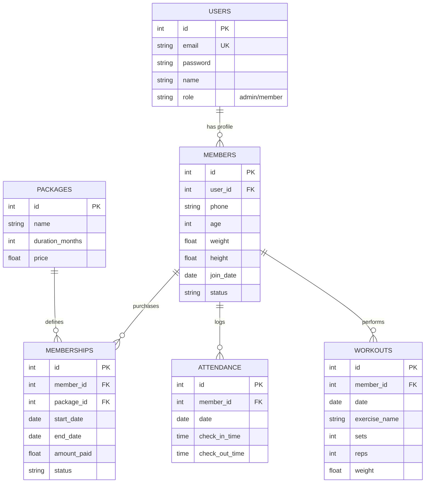
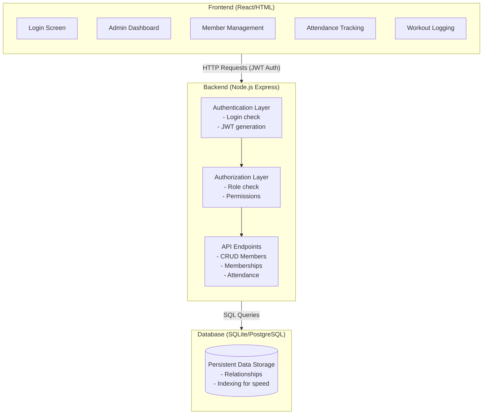
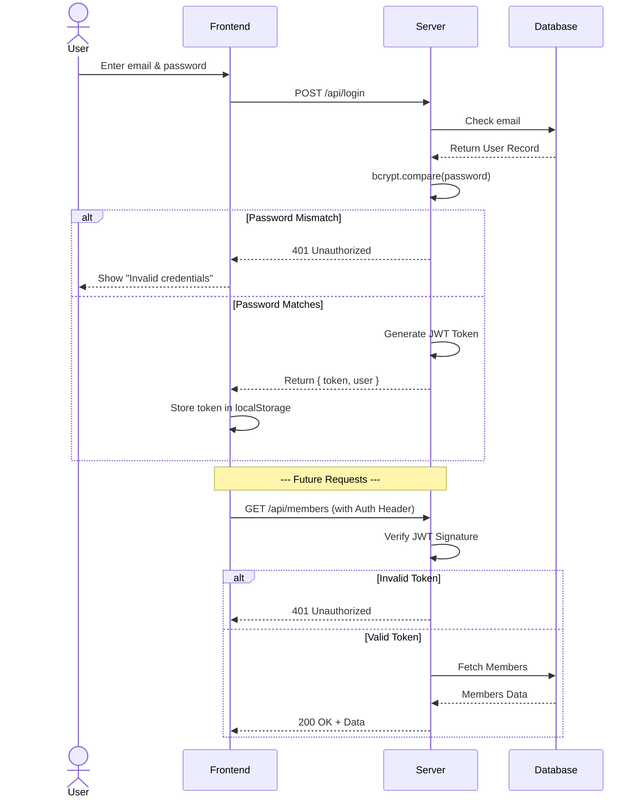

# 💪 Gym Management System: Learn By Building

**"Build a complete system for managing gyms. Understand databases, roles, and complex workflows."**

---

## 🎯 Learning Outcomes

After completing this project, you will understand:

✅ **Multi-User Systems** - Admin vs Member roles and permissions  
✅ **Complex Data Models** - Members, memberships, attendance, workouts  
✅ **Relationships** - Foreign keys, joins, data integrity  
✅ **Authentication** - Login, JWT tokens, password hashing  
✅ **Authorization** - Role-based access control  
✅ **Business Logic** - Membership renewal, attendance tracking  
✅ **Full-Stack Development** - Frontend + Backend + Database  
✅ **Data Persistence** - Saving and retrieving relational data  

---

## 📋 Project Overview

### The Problem

Gyms need to manage:
- Members (who they are, contact info, when they joined)
- Memberships (what package, when expires, payment)
- Attendance (who came today, how long they stayed)
- Workouts (what exercises, progress tracking)
- Staff (admin dashboard, management tools)

**Your job:** Build a system for all this.

### Who Uses It

```
Admin User:
├─ Dashboard (stats, revenue, attendance)
├─ Manage Members (add, edit, delete)
├─ Manage Memberships (packages, renewals)
├─ View Attendance (daily, reports)
└─ Analytics (popular times, member retention)

Member User:
├─ Profile (personal info, membership status)
├─ Log Workouts (exercises, progress)
├─ View Attendance (check-in history)
└─ See Membership Status (expiration date)
```

---

## 🏗️ Architecture: Design Before Coding

### Step 1: Understand the Data (Design Yourself First)

**Question: What information must the system store?**

Think about these scenarios:
1. Admin checks how many members are currently active
2. Member logs a workout (exercise: chest press, 4 sets, 8 reps)
3. System checks if membership is expired
4. Admin wants to know attendance for this month
5. Member renews membership

**What data do you need for each?**

After thinking, here's the data model:

```
Users (for login)
├─ id
├─ email (unique)
├─ password (hashed)
├─ name
├─ role (admin or member)
└─ created_at

Members (member information)
├─ id
├─ user_id (links to Users)
├─ phone
├─ age
├─ weight
├─ height
├─ join_date
└─ status (active/inactive)

Memberships (membership packages and purchases)
├─ id
├─ member_id
├─ package_id
├─ start_date
├─ end_date
├─ amount_paid
└─ status (active/expired/renewed)

Packages (membership types offered)
├─ id
├─ name (Basic, Premium, etc)
├─ duration_months
├─ price
└─ features (comma-separated or separate table)

Attendance (check-in records)
├─ id
├─ member_id
├─ date
├─ check_in_time
├─ check_out_time
├─ duration_minutes
└─ notes

Workouts (exercise logs)
├─ id
├─ member_id
├─ date
├─ exercise_name
├─ sets
├─ reps
├─ weight
└─ notes
```

---

### Step 2: Database Architecture



---

### Step 3: System Architecture



---

## 🔐 Authentication & Authorization: Plan This First

### Authentication Flow



### JWT Token Structure

```
Token: eyJhbGciOiJIUzI1NiIsInR5cCI6IkpXVCJ9...

Decoded contains:
{
  "userId": 123,
  "email": "admin@gym.com",
  "role": "admin",
  "iat": 1234567890,
  "exp": 1234654290
}

Expires in: 7 days
```

### Authorization: Role-Based Access Control

```
Admin can:
├─ View all members
├─ Add/edit/delete members
├─ Manage memberships
├─ View all attendance
├─ View dashboard stats
└─ View all workouts

Member can:
├─ View own profile
├─ Log own workouts
├─ View own attendance
├─ View own membership status
└─ NOT view other members
```

---

## 🗄️ Database Design: Questions to Answer

### Question 1: How do you prevent passwords being stored plaintext?

**Answer:** Hash them with bcryptjs
```
When user registers:
  1. Take password: "password123"
  2. Hash it: bcryptjs.hash("password123", 10)
  3. Result: "$2a$10$N9qo8uLOic..."
  4. Store the hash, NOT the plaintext

When user logs in:
  1. Get plaintext password from form
  2. Get hash from database
  3. Compare: bcryptjs.compare("password123", "$2a$10$...")
  4. Result: true/false (no plaintext ever compared)
```

### Question 2: What if membership expires?

**Answer:** Store dates, check before allowing gym access
```
Membership:
├─ start_date: 2026-01-15
├─ end_date: 2026-02-15
└─ status: active

When member tries to access:
1. Query their latest membership
2. Check if end_date > today
3. If yes: allow
4. If no: show "Membership expired, renew to continue"
```

### Question 3: How do you track attendance accurately?

**Answer:** Check-in and check-out times
```
When member arrives:
  POST /api/attendance
  Body: { memberId: 123 }
  
  Create record:
  {
    member_id: 123,
    date: 2026-01-20,
    check_in: 06:30 AM,
    check_out: null,
    duration: null
  }

When member leaves:
  PUT /api/attendance/123/checkout
  
  Update record:
  {
    check_out: 07:45 AM,
    duration: 75 (minutes)
  }
```

---

## 🔌 API Endpoints: Plan Them All

### Authentication

```
POST /api/auth/login
  Input: { email, password }
  Output: { token, user }
  
POST /api/auth/register
  Input: { email, password, name, role }
  Output: { token, user }

GET /api/auth/verify
  Headers: Authorization: Bearer <token>
  Output: { valid: true, user }
```

### Members Management (Admin Only)

```
GET /api/members
  Returns: [{ id, name, email, phone, status, join_date }, ...]

GET /api/members/:id
  Returns: { id, name, email, phone, age, weight, height, status }

POST /api/members
  Input: { name, email, phone, age, weight, height }
  Output: { id, ... }

PUT /api/members/:id
  Input: { name, phone, weight, height }
  Output: { id, ... }

DELETE /api/members/:id
  Output: { message: "Member deleted" }
```

### Memberships

```
GET /api/memberships
  Returns: [{ id, member_id, package_id, start_date, end_date, status }, ...]

POST /api/memberships
  Input: { member_id, package_id, duration_months }
  Output: { id, member_id, start_date, end_date }

GET /api/packages
  Returns: [{ id, name, duration_months, price, features }, ...]
```

### Attendance

```
GET /api/attendance?member_id=123
  Returns: [{ id, member_id, date, check_in, check_out, duration }, ...]

POST /api/attendance
  Input: { member_id }
  Output: { id, member_id, check_in_time }

PUT /api/attendance/:id/checkout
  Output: { id, check_out_time, duration_minutes }
```

### Workouts

```
GET /api/workouts?member_id=123
  Returns: [{ id, member_id, date, exercise, sets, reps, weight }, ...]

POST /api/workouts
  Input: { member_id, exercise, sets, reps, weight, notes }
  Output: { id, ... }

DELETE /api/workouts/:id
  Output: { message: "Workout deleted" }
```

### Dashboard (Admin Only)

```
GET /api/dashboard
  Returns: {
    totalMembers: 150,
    activeMembers: 120,
    todayAttendance: 45,
    totalRevenue: 50000,
    membershipStats: { ... }
  }
```

---

## 🧠 Implementation Strategy: Pseudocode

### Login Flow

```pseudocode
POST /api/auth/login(email, password):
  Step 1: Find user by email
    user = database.query("SELECT * FROM users WHERE email = ?")
    if user not found:
      return error 401 "Invalid credentials"
  
  Step 2: Compare passwords
    passwordMatch = bcryptjs.compare(password, user.password_hash)
    if not match:
      return error 401 "Invalid credentials"
  
  Step 3: Generate JWT token
    token = jwt.sign(
      { userId: user.id, role: user.role },
      secret_key,
      { expiresIn: "7d" }
    )
  
  Step 4: Return token and user info
    return {
      token: token,
      user: {
        id: user.id,
        name: user.name,
        email: user.email,
        role: user.role
      }
    }
```

### Add Member (Admin Only)

```pseudocode
POST /api/members(name, email, phone, age, weight, height):
  Step 1: Verify user is admin
    if request.user.role != "admin":
      return error 403 "Unauthorized"
  
  Step 2: Validate input
    if not email or not name or not phone:
      return error 400 "Missing required fields"
    
    if not isValidEmail(email):
      return error 400 "Invalid email"
  
  Step 3: Check if email already exists
    exists = database.query("SELECT id FROM users WHERE email = ?")
    if exists:
      return error 400 "Email already registered"
  
  Step 4: Create user and member records
    (This requires a transaction - both must succeed or both fail)
    
    START TRANSACTION:
      user_id = database.insert("users", { email, name, role: "member" })
      member_id = database.insert("members", {
        user_id,
        phone,
        age,
        weight,
        height,
        join_date: today
      })
    COMMIT
  
  Step 5: Return created member
    return { id: member_id, name, email, phone, age, weight, height }
```

### Mark Attendance

```pseudocode
POST /api/attendance(member_id):
  Step 1: Verify user is admin or is the member
    if request.user.role == "member":
      if request.user.id != member_id:
        return error 403 "Can't check in other members"
  
  Step 2: Verify member exists
    member = database.query("SELECT id FROM members WHERE id = ?")
    if not member:
      return error 404 "Member not found"
  
  Step 3: Check if already checked in today
    today = currentDate()
    existing = database.query(
      "SELECT id FROM attendance WHERE member_id = ? AND date = ? AND check_out IS NULL"
    )
    if existing:
      return error 400 "Already checked in"
  
  Step 4: Create attendance record
    attendance_id = database.insert("attendance", {
      member_id: member_id,
      date: today,
      check_in_time: now(),
      check_out_time: null,
      duration_minutes: null
    })
  
  Step 5: Return record
    return { id: attendance_id, member_id, check_in_time }
```

---

## ⚠️ Common Mistakes

### ❌ Mistake 1: No Transaction for Related Records

**Wrong:**
```javascript
// If this crashes between two inserts:
db.insert("users", userData);
// Server crashes here
db.insert("members", memberData);
// Result: user exists but no member
```

**Right:**
```javascript
// All or nothing
db.transaction(() => {
  db.insert("users", userData);
  db.insert("members", memberData);
});
```

### ❌ Mistake 2: Trusting Role from Frontend

**Wrong:**
```javascript
if (req.body.role === "admin") { // User can send admin!
  // Give admin access
}
```

**Right:**
```javascript
if (req.user.role === "admin") { // Get from JWT token
  // Give admin access
}
```

### ❌ Mistake 3: Not Checking Membership Expiration

**Wrong:**
```javascript
// Just let member access
app.post('/api/workouts', (req, res) => {
  // Log workout without checking membership
});
```

**Right:**
```javascript
app.post('/api/workouts', (req, res) => {
  // Check membership first
  const membership = db.query(
    "SELECT * FROM memberships WHERE member_id = ? AND status = 'active' AND end_date > today"
  );
  if (!membership) {
    return res.status(403).json({ error: 'Membership expired' });
  }
  // Log workout
});
```

### ❌ Mistake 4: Allowing Anyone to View Any Member

**Wrong:**
```javascript
app.get('/api/members/:id', (req, res) => {
  // Return member info without checking permissions
  const member = db.query('SELECT * FROM members WHERE id = ?');
  return res.json(member);
});
```

**Right:**
```javascript
app.get('/api/members/:id', (req, res) => {
  if (req.user.role !== 'admin' && req.user.id !== id) {
    return res.status(403).json({ error: 'Unauthorized' });
  }
  const member = db.query('SELECT * FROM members WHERE id = ?');
  return res.json(member);
});
```

---

## 🧪 Testing Scenarios

### Scenario 1: Admin Adds Member

```
1. Admin logs in
2. Goes to "Add Member"
3. Fills: name, email, phone, age, weight, height
4. Clicks "Add"
5. Expected: Member appears in list, can log in with email
6. Verify: Can't add duplicate email
```

### Scenario 2: Member Checks In

```
1. Member arrives, scans QR or enters ID
2. System marks check-in: 06:30 AM
3. Member works out
4. Member leaves, scans/enters again
5. System marks check-out: 07:45 AM
6. Duration calculated: 75 minutes
7. Analytics: Today's attendance shows 75 minutes
```

### Scenario 3: Membership Renewal

```
1. Member's membership expires: 2026-02-15
2. Admin renews for 3 months
3. New end_date: 2026-05-15
4. Member can continue accessing system
```

### Scenario 4: Unauthorized Access

```
1. Member tries to access admin dashboard
2. Expected: Denied with 403 error
3. Member tries to view other member's workouts
4. Expected: Denied with 403 error
5. Someone tries to modify JWT token
6. Expected: Token invalid, denied
```

---

## 📚 Resources

**Authentication & Security:**
- JWT: https://jwt.io
- bcryptjs: https://www.npmjs.com/package/bcryptjs
- Password best practices: https://owasp.org/www-project-cheat-sheets/

**Database Design:**
- SQL relationships: https://www.sqlitetutorial.net/sqlite-foreign-key/
- Transactions: https://www.sqlite.org/lang_transaction.html
- Normalization: https://www.sqlitetutorial.net/sqlite-normalization/

**Design Patterns:**
- MVC architecture: https://en.wikipedia.org/wiki/Model%E2%80%93view%E2%80%93controller
- Role-based access: https://en.wikipedia.org/wiki/Role-based_access_control
- API design: https://restfulapi.net/

---

## ✅ Before Submission

- [ ] Authentication works (login, JWT)
- [ ] Role-based access works (admin vs member)
- [ ] All CRUD operations work
- [ ] Membership expiration checked
- [ ] Attendance tracking works
- [ ] Data persists across restarts
- [ ] Errors handled gracefully
- [ ] Can demo 5 features
- [ ] Can explain architecture
- [ ] Code is on GitHub

**Success:** A complete system that actually works, and you understand every part.
