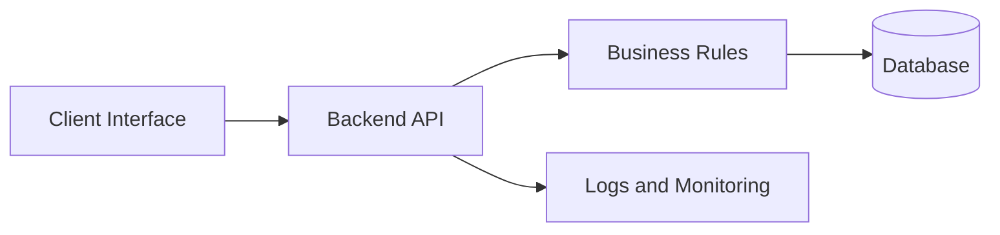

# Project Documentation Template

Use this template to create a new learning-first project chapter. It describes what students must understand before implementation without providing a copy-paste solution.

## Project Overview

Explain the real-world problem, target users, and expected outcome in one or two paragraphs. Keep the focus on system behavior, not frameworks.

## Why This Project Exists

Describe the engineering lessons: data modeling, API design, validation, deployment, security, usability, operations, or product thinking.

## Where It Fits

State whether the project is beginner, intermediate, or advanced, and link prerequisites such as:

- [Learning-First Philosophy](../philosophy/LEARNING_FIRST.md)
- [Database Design 101](../guides/database-design-101.md)
- [API Design Best Practices](../guides/api-design-best-practices.md)

## Core Concepts

Define the domain vocabulary before asking students to design anything. Include entities, roles, workflows, constraints, and failure cases.

## Architecture

Explain each component, why it exists, and what it must not do.

## Data Model

List entities, important fields, relationships, uniqueness rules, and retention needs. Explain trade-offs such as normalization versus query simplicity.

## API Design

Describe resources, actions, authentication needs, validation rules, status codes, and error behavior. Do not include implementation code.

## Workflow

1. Understand requirements.
2. Draw architecture and data flow.
3. Design schema and API contracts.
4. Write pseudocode.
5. Implement in small checkpoints.
6. Test locally.
7. Deploy and observe.
8. Prepare explanation for review or interview.

## Best Practices

- Prefer simple designs that can be explained.
- Keep secrets out of source control.
- Validate input on the server.
- Record design decisions and trade-offs.
- Make failures visible through logs and tests.

## Common Mistakes

- Choosing tools before understanding requirements.
- Designing tables directly from screen layouts.
- Returning inconsistent API errors.
- Ignoring deployment and maintenance until the end.

## Scaling Considerations

Explain what changes when users, data volume, traffic, team size, or compliance requirements increase. Mention indexes, caching, background jobs, monitoring, and cost control only when relevant.

## Business Perspective

Connect technical decisions to user trust, operating cost, support effort, data ownership, and commercialization.
