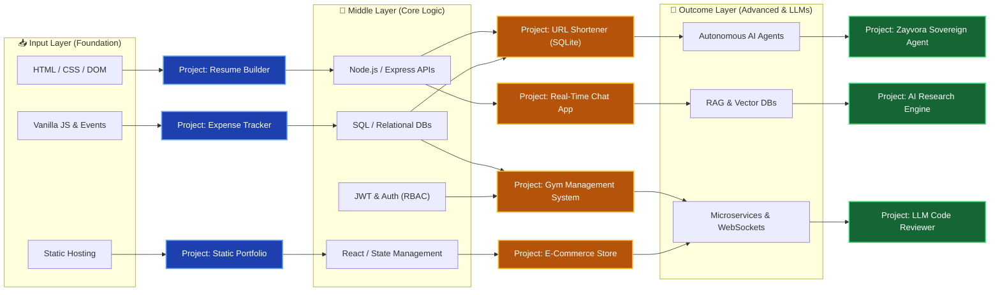

# 🧠 The Developer Neural Network: Project Roadmap

Building 115 projects randomly will not make you a great engineer. You must build them in a specific sequence, just like data flowing through a Neural Network. 

Think of your learning journey as a 3-Layer Neural Network:
1. **Input Layer (The Foundation):** What you must learn and build first.
2. **Hidden/Middle Layer (The Core Logic):** Where the heavy lifting (APIs, Databases, State) happens.
3. **Outcome Layer (The Vanguard):** Advanced systems, AI/LLMs, and complex architectures.

Follow this graph left-to-right to know exactly what to build next.

---

## 📊 The Learning Graph

---

## 📥 1. Input Layer (The Foundation)
**Goal:** Learn the browser, the DOM, variables, loops, and static hosting. Do not touch a database yet.
- **What to learn:** HTML5, CSS3, Vanilla JavaScript, DOM Manipulation, LocalStorage, Vercel/GitHub Pages.
- **Projects to build:** Resume Builder, Calculator, Expense Tracker, Static Portfolio.
- **Why?** You need to understand how the user interfaces with data before you learn how to process it on a server.

## 🧠 2. Middle Layer (The Core Logic)
**Goal:** Learn how systems talk to each other and how to persist data securely.
- **What to learn:** Node.js, REST APIs, SQL (SQLite/PostgreSQL), NoSQL (MongoDB), Authentication (JWT), MVC Architecture.
- **Projects to build:** URL Shortener, Gym Management System, E-Commerce API, Real-time Chat (WebSockets).
- **Why?** This is the hidden layer where 90% of a Software Engineer's job happens. If you skip this layer, your AI projects in the next layer will fail because you won't understand how to connect them to databases or APIs.

## 🚀 3. Outcome Layer (The Vanguard)
**Goal:** Learn AI orchestration, distributed systems, and modern LLM pipelines.
- **What to learn:** Large Language Models (LLMs), RAG (Retrieval-Augmented Generation), Vector Databases (Pinecone/Chroma), Agentic Workflows (Zayvora/LangChain), Microservices.
- **Projects to build:** Autonomous Research Agent, AI Customer Support Bot, Automated Code Reviewer.
- **Why?** These are the systems of the future. But notice how they sit at the **end** of the network? You cannot build an AI that manages a database if you don't first know how to build a database (Layer 2).

---

### 👉 **[Click here to view all 115 projects in the Directory](./ALL_PROJECTS_INDEX.md)**
