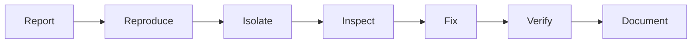

# Debugging Techniques

Debugging is the disciplined process of finding the gap between expected behavior and actual behavior. It is investigation, not guessing.

## Workflow

1. Reproduce the problem reliably.
2. Describe expected and actual behavior.
3. Identify the smallest failing boundary.
4. Inspect inputs, state, logs, and outputs.
5. Change one thing at a time.
6. Add a test or note so the bug is easier to catch later.

## Common Mistakes

- Editing random files until the symptom disappears.
- Ignoring logs and error messages.
- Fixing the visible symptom while leaving the root cause.
- Debugging production without a rollback plan.

## Further Reading

- [Backend Debugging](./backend-debugging.md)
- [Testing](../learning-tracks/developer-ecosystem/modules/28-testing.md)

