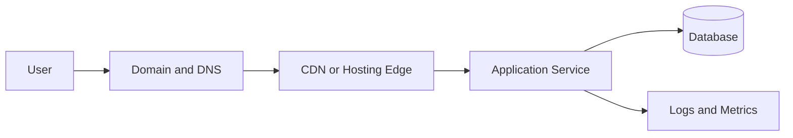

# Deployment Checklist Template

Use this checklist before calling a student project “live”. Deployment is not only uploading files; it is the engineering process of making a system reachable, observable, recoverable, and safe for real users.

## 1. Purpose

A deployment checklist reduces avoidable production failures. It forces the team to confirm assumptions about configuration, data, security, cost, and rollback before users depend on the system.

## 2. Architecture Review

Confirm:

- The runtime, database, storage, and third-party services are identified.
- Environment variables are documented and not committed to Git.
- The application can start from a clean deployment environment.
- Persistent data is stored outside the application container or build folder.

## 3. Pre-Deployment Checks

- Requirements are stable enough to release.
- Main user flows have been tested locally.
- Database migrations or schema changes are planned.
- Authentication and authorization rules are reviewed.
- Error messages do not expose secrets, stack traces, or private data.
- Dependencies are installed from lockfiles where possible.

## 4. Release Workflow

1. Create a small release candidate.
2. Run automated checks.
3. Deploy to a preview or staging environment if available.
4. Test critical workflows using production-like configuration.
5. Deploy to production.
6. Watch logs, metrics, and user reports.
7. Record what changed and how to roll back.

## 5. Operations Checklist

- Logs show startup success and request failures.
- Health checks verify the app and database are reachable.
- Backups exist for important data.
- Rollback is documented.
- Rate limits or abuse controls exist for public endpoints.
- Domain, HTTPS, and redirect behavior are verified.

## 6. Business Perspective

Deployment choices affect cost, reliability, and trust. Free tiers are useful for learning, but production systems need clear limits, backup plans, support ownership, and monitoring. A cheap deployment that loses data or fails silently can become expensive through user churn and manual recovery work.

## 7. Common Mistakes

- Treating localhost success as production readiness.
- Storing uploaded files on temporary disks.
- Forgetting environment variables during redeployments.
- Deploying large changes without rollback.
- Ignoring logs until users complain.

## Further Reading

- [Deployment Guides](../guides/deployment-guides.md)
- [What Next After Building](../guides/03_WHAT_NEXT_AFTER_BUILDING.md)
- [Production Readiness](../learning-tracks/developer-ecosystem/modules/33-production-readiness.md)
